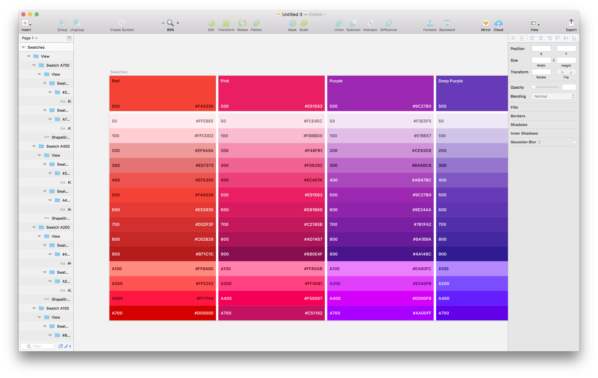
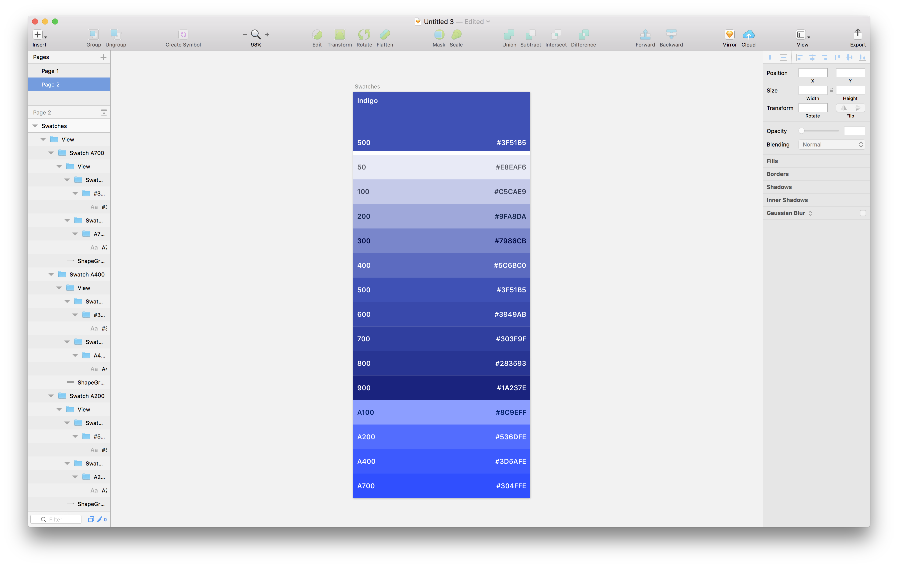

# Sketch Palette Generator

This plugin allows you to output a colour palette defined in JSON to Sketch.



[📹 Watch demo](https://www.youtube.com/watch?v=bbrRPYByRx8)

## Why?

Defining a colour palette in JSON makes it easy to share colours between Sketch files and with developers. The JSON file can easily be converted to Sass variables using [json-sass](https://github.com/acdlite/json-sass).

## Install

1. [Download the ZIP file and unzip](https://github.com/TimonVS/sketch-palette-generator/releases/download/v0.1/sketch-palette-generator.sketchplugin.zip)
2. Open sketch-palette-generator.sketchplugin

## How to use

1. Download and install the Sketch plugin

2. Define your colour palette in a JSON file:

```json
{
  "Indigo": {
    "50": "#E8EAF6",
    "100": "#C5CAE9",
    "200": "#9FA8DA",
    "300": "#7986CB",
    "400": "#5C6BC0",
    "500": "#3F51B5",
    "600": "#3949AB",
    "700": "#303F9F",
    "800": "#283593",
    "900": "#1A237E",
    "A100": "#8C9EFF",
    "A200": "#536DFE",
    "A400": "#3D5AFE",
    "A700": "#304FFE"
  }
}
```

3. Open Sketch and create a new page (⚠️ important, because the plugin will override your current page)

3. Click Plugins > Palette generator

4. Select the JSON file created earlier

5. Done! You should now get something like this:


